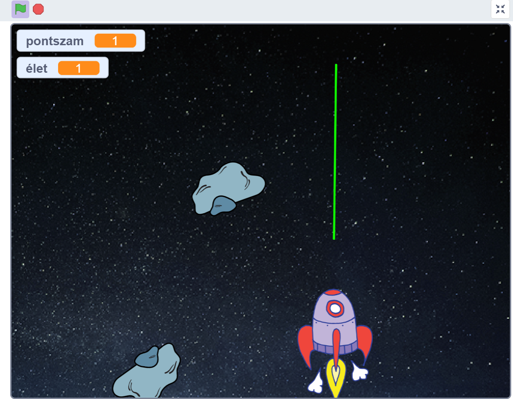

## A játékról
Egy űrhajót irányítunk az egér segítségével. A cél, hogy a folyamatosan érkező aszteroidákat kilőjük a lézerünkkel (szóköz lenyomásával). A program használ klónozást, változókat és feltételeket is.

## Képernyőmentés a játékról

